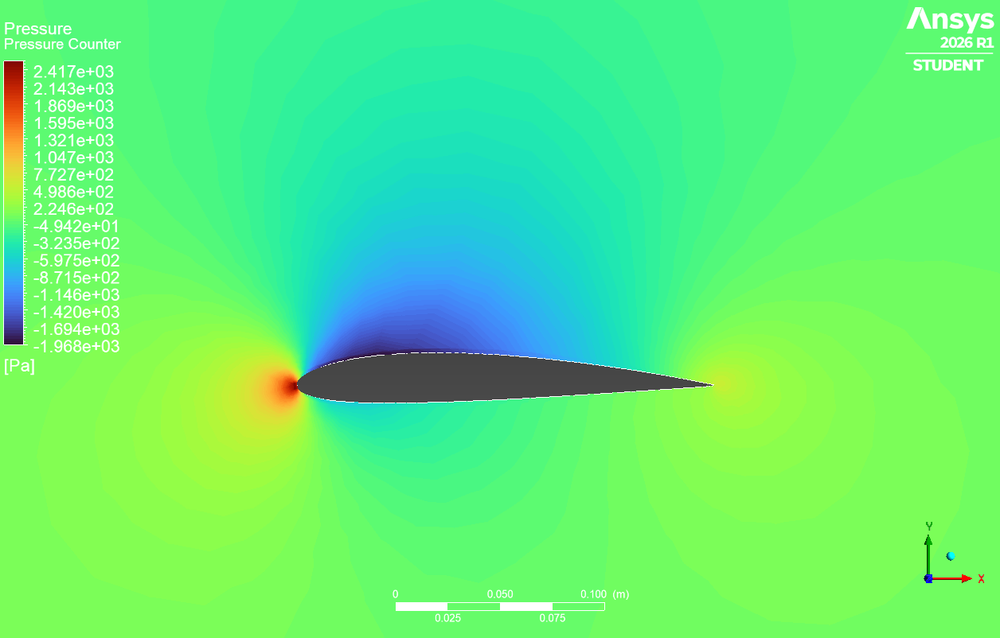
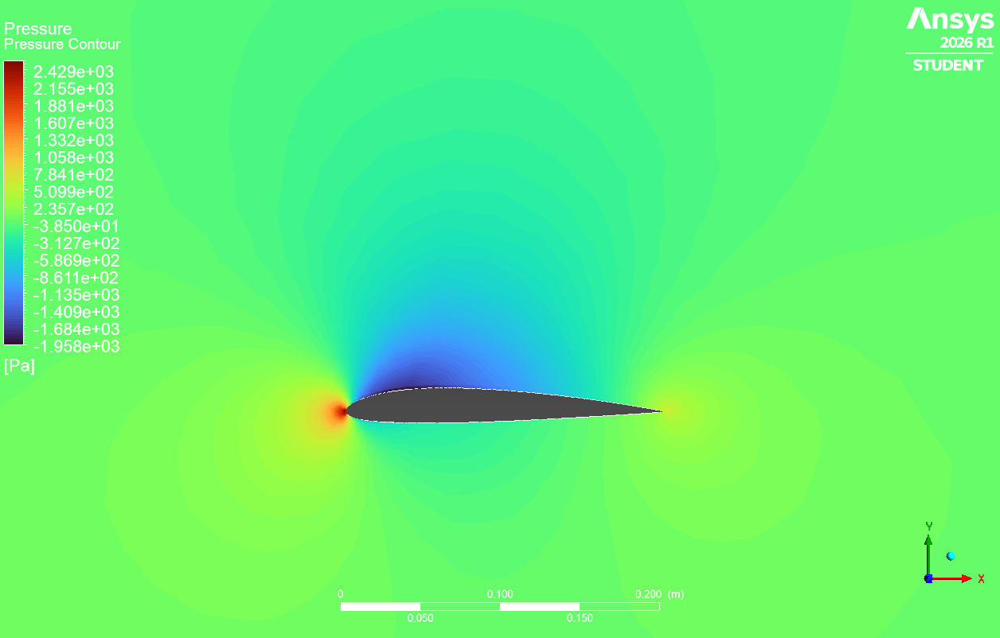
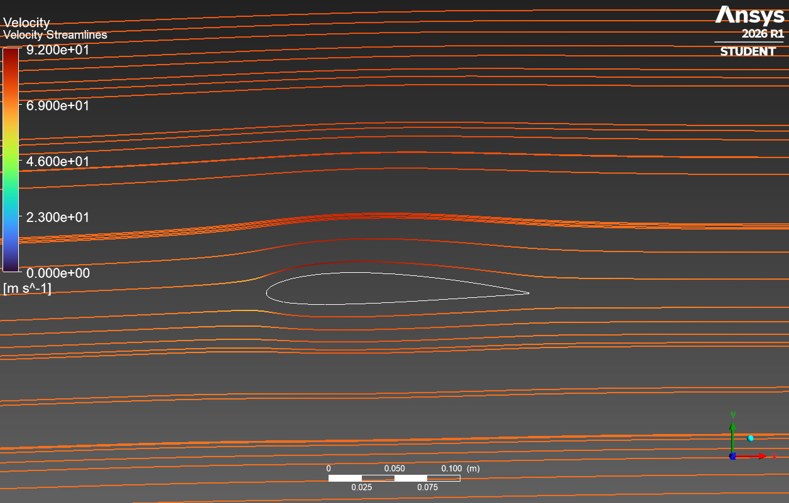
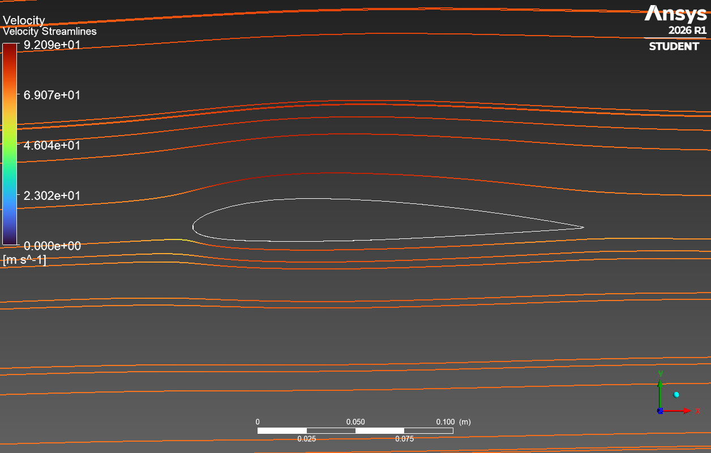
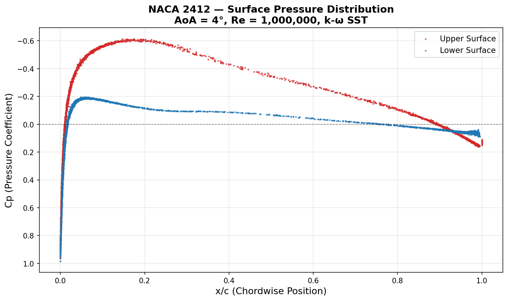
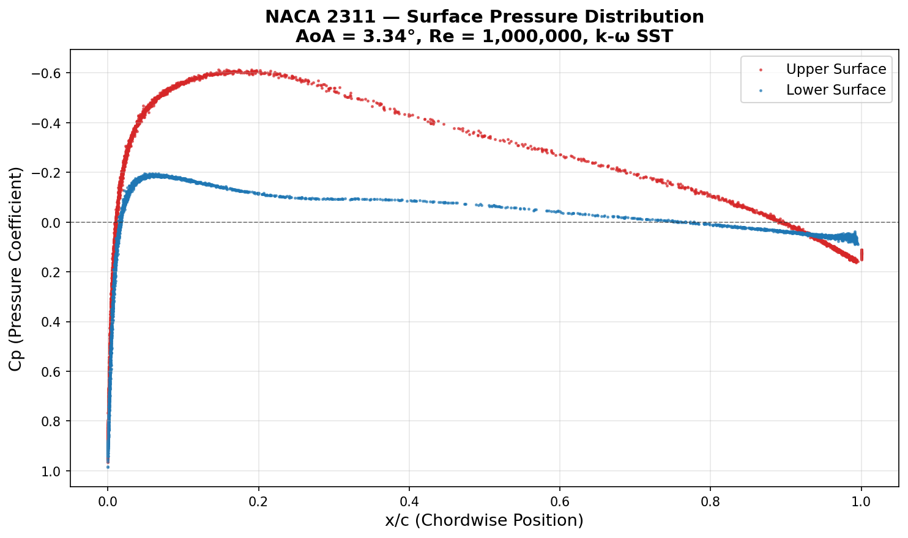

# ✈️ Aerodynamic Airfoil Optimization Dashboard

An interactive Streamlit web application that computes, analyzes, and optimizes NACA 4-digit airfoil geometries using NeuralFoil as the aerodynamic solver and SLSQP as the mathematical optimizer. Designed for rapid aerodynamic design exploration across multiple aircraft categories.

**Live App:** [airfoil-optimization.streamlit.app](https://airfoil-optimization.streamlit.app/)

---

## Overview

This project combines a real-time airfoil optimization web app with a full 3D CFD validation study conducted in ANSYS Fluent. The optimizer identifies the best-performing NACA 4-digit profile for a given flight condition; the CFD study independently validates the aerodynamic improvement using finite volume simulation.

The baseline and optimized profiles selected for validation are:

| | Profile | AoA | Cl | Cd | L/D |
|---|---|---|---|---|---|
| **Baseline** | NACA 2412 | 4.00° | 0.710 | 0.01880 | 37.78 |
| **Optimized** | NACA 2311 | 3.34° | 0.622 | 0.01600 | 38.67 |
| **Net Gain** | — | — | — | — | **+2.4%** |

> Values from NeuralFoil (2D, infinite span). See CFD Validation section for 3D simulation results.

---

## Features

- **Aircraft Presets** — Domain-specific configurations for RC planes, gliders, general aviation, and commercial airliners with automatically tuned slider ranges and flow conditions
- **Dynamic Geometry Generation** — Live NACA 4-digit airfoil rendering using cosine spacing for enhanced leading and trailing edge resolution
- **NeuralFoil Aerodynamic Solver** — Physics-informed neural network backend (`xlarge` model) for rapid viscous Cl/Cd prediction across Reynolds number ranges
- **SLSQP Optimization** — SciPy-based constrained optimization maximizing L/D ratio subject to user-defined minimum Cl, thickness bounds, and camber bounds
- **Performance Sweeps** — Automated AoA sweeps (0°–10°) computing Cl and L/D curves for both baseline and optimized profiles
- **Polished UI/UX** — Dark-themed responsive dashboard with custom CSS glass-card components and real-time metric updates

---

## CFD Validation Study

To validate the optimizer's output, both the baseline (NACA 2412) and optimized (NACA 2311) profiles were independently simulated in ANSYS Fluent using a 3D finite volume approach.

### Methodology

| Parameter | Value |
|---|---|
| Solver | ANSYS Fluent 2026 R1 (Pressure-Based, Steady) |
| Turbulence Model | k-ω SST |
| Reynolds Number | 1,000,000 |
| Freestream Velocity | 73.03 m/s |
| Chord Length | 200 mm |
| Wing Span | 500 mm |
| Domain Size | 10c upstream, 20c downstream, 10c top/bottom |
| Mesh Type | Unstructured tetrahedral + inflation layers |
| Inflation Layers | 10 layers, first height 0.1 mm, growth rate 1.2 |
| Aircraft Category | Glider (AR = 18) |

### CFD Results

| | NACA 2412 (Baseline) | NACA 2311 (Optimized) |
|---|---|---|
| Cl | 0.2798 | 0.2537 |
| Cd | 0.02791 | 0.02646 |
| L/D | 10.02 | 9.59 |
| Mesh Cells | ~698,000 | ~698,000 |
| Orthogonal Quality (min) | 0.062 | 0.026 |
| Skewness (max) | 0.00039 | 0.00045 |

### Interpreting the Discrepancy

The absolute Cl/Cd values differ from NeuralFoil predictions for well-understood reasons:

1. **2D vs 3D** — NeuralFoil solves an infinite-span 2D section. The CFD model is a finite wing at AR = 18, introducing spanwise flow and wingtip-induced drag effects
2. **Mesh resolution** — The student license cell cap (1,048,576 cells) constrained mesh refinement, particularly in the boundary layer. Face sizing of 30 mm on the airfoil surface under-resolves the suction peak, leading to Cl underprediction
3. **Operating point** — NeuralFoil runs at AoA = 4°; the CFD domain applies velocity components (Vx = 72.86 m/s, Vy = 5.09 m/s) equivalent to 4° freestream angle

The **trend is consistent across both methods** — NACA 2311 produces lower Cd than NACA 2412 in both the 2D optimizer and 3D CFD, confirming the optimizer's directional validity. The absolute gap is a known artefact of coarse-mesh 3D simulation vs calibrated 2D neural network prediction.

---

### Pressure Contour — NACA 2412


### Pressure Contour — NACA 2311


### Velocity Streamlines — NACA 2412


### Velocity Streamlines — NACA 2311


### Surface Pressure Distribution (Cp) — NACA 2412


### Surface Pressure Distribution (Cp) — NACA 2311


---

## Known Limitations

- **Induced drag accounting** — The app displays 2D L/D values from NeuralFoil. Finite wing induced drag (CDi = CL²/πARe) is computed separately within the optimizer constraints but is not reflected in the displayed efficiency metric. True 3D L/D will be lower, as confirmed by CFD
- **Low Reynolds number** — NeuralFoil accuracy degrades below Re = 10⁵ due to transitional flow effects. The app defaults to the empirical backend in this regime
- **Stall modelling** — A sharp penalty is applied above effective AoA of 12° to prevent non-physical predictions. This is a simplification; real stall behaviour is geometry-dependent

---

## Installation & Setup

Requires Python 3.8+.

**1. Clone the repository:**
```bash
git clone https://github.com/YOUR_USERNAME/YOUR_REPOSITORY_NAME.git
cd YOUR_REPOSITORY_NAME
```

**2. Create and activate a virtual environment:**
```bash
# Windows
python -m venv venv
venv\Scripts\activate

# macOS/Linux
python3 -m venv venv
source venv/bin/activate
```

**3. Install dependencies:**
```bash
pip install -r requirements.txt
```

**4. Launch the app:**
```bash
streamlit run app.py
```
